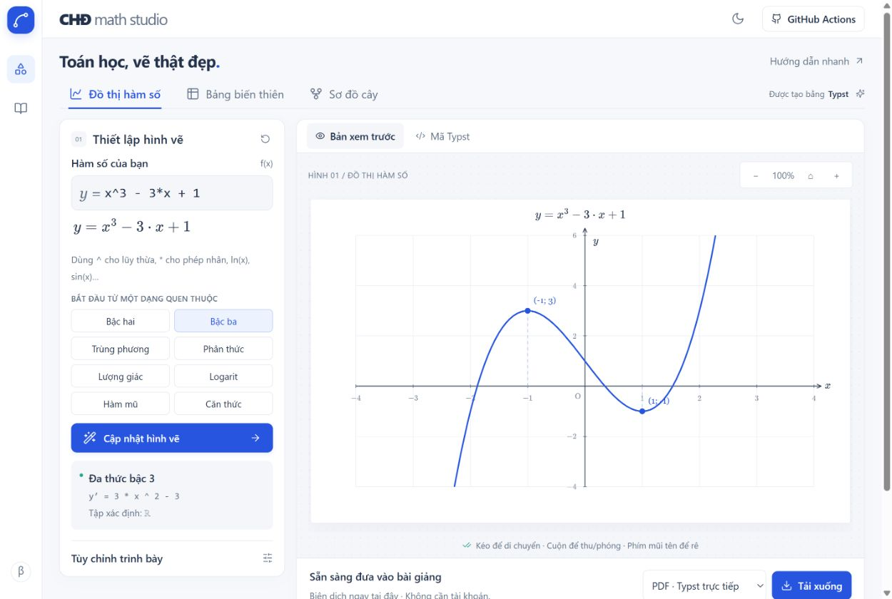
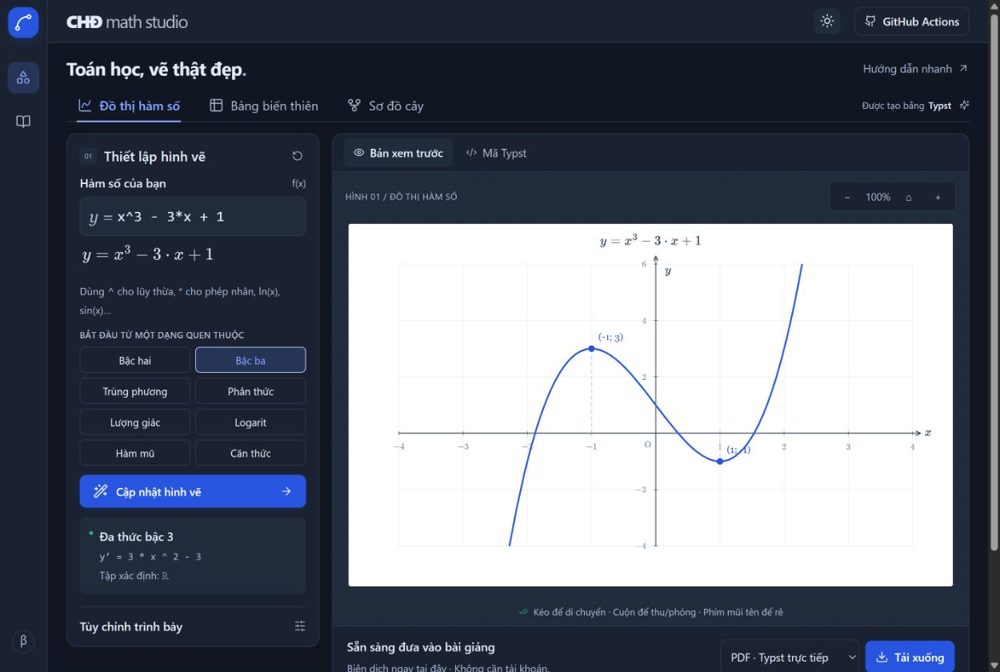

<div align="center">

# CHĐ Math Studio
### Toán học, vẽ thật đẹp.

**Thiết kế bởi Chân Đức** · Dành cho người dạy Toán

Một công thức. Những hình vẽ chỉn chu. Sẵn sàng cho bài giảng tiếp theo.

[**MỞ XƯỞNG HÌNH VẼ →**](https://aichanduc.github.io/chd-math-studio/)

[](https://github.com/aichanduc/chd-math-studio/actions/workflows/pages.yml)
[](https://github.com/aichanduc/chd-math-studio/actions/workflows/ci.yml)

**Đồ thị hàm số · Bảng biến thiên · Sơ đồ cây · PDF / PNG / SVG**

</div>



## Mới trong bản 1.2

- **Bảng biến thiên tùy chỉnh** có tab riêng, giữ bảng độc lập với bảng từ công thức. Bấm **Phác họa** cạnh **Bản xem trước** để đổi qua lại giữa bảng và đồ thị minh họa.
- Bật **Vẽ nhiều đồ thị trên một hình**: tối đa 6 hàm, mỗi hàm có màu riêng, có thể ẩn/hiện hoặc xóa. PDF, PNG, SVG và dự án JSON giữ các hàm đang hiển thị.
- **Ox và Oy cùng tỉ lệ đơn vị 1:1**. Miền x/y quyết định chiều dài vùng vẽ; kéo rê và thu/phóng vẫn giữ đúng tỉ lệ.

## Các cải tiến giao diện

- Chữ lớn, font hệ thống dễ đọc, header gọn để ưu tiên vùng vẽ.
- Kéo rê đồ thị, cuộn thu/phóng theo con trỏ, phím mũi tên và nút ⌂ về khung ban đầu. Miền tọa độ mới được lưu và xuất đúng như đang xem.
- Bấm trực tiếp các ô x, y′, y hoặc dấu khoảng trên bảng để sửa; dấu ⋮ cho phép ngắt dòng y và nhập giới hạn hai bên.
- Phân số, căn, số mũ được dàn thành công thức vector. Mã bảng dùng hàm `bbt` tự chứa và dữ liệu theo hàng; mã đồ thị được rút gọn điểm thẳng hàng.

## Bắt đầu trong một phút

1. [Mở website](https://aichanduc.github.io/chd-math-studio/), chọn **Đồ thị hàm số**, **Bảng biến thiên** hoặc **Sơ đồ cây**.
2. Nhập `x^3 - 3*x + 1`, chọn một mẫu quen thuộc, hoặc tự chỉnh từng ô trong bảng.
3. Chọn **PDF · Typst trực tiếp** rồi **Tải xuống**. Bạn cũng có thể tải PNG, SVG hoặc mã `.typ` để chỉnh sửa tiếp.

**Không cần cài đặt, đăng nhập hay token.** PDF được biên dịch bằng Typst WebAssembly ngay trên thiết bị của bạn. Lần đầu tải bộ biên dịch khoảng 28 MB; công thức không được gửi tới máy chủ biên dịch. SVG/PNG được xuất nhanh từ mô hình hình vẽ chung với mã Typst.

## Một xưởng hình vẽ, nhiều cách dùng

| Công việc | Bạn có thể làm gì? |
| --- | --- |
| Đồ thị | Nhập biểu thức, chỉnh miền tọa độ, lưới, màu và điểm dừng; xem trước tức thì. |
| Bảng tự động | Đa thức bậc 0–4, phân thức bậc nhất/bậc nhất, `exp(x)`, `e^x`, `ln(x)`, `sqrt(x)`. |
| Bảng thủ công | 2–10 mốc; sửa từng hàng x, y′, y; dấu +, −, 0, \|\|; giới hạn trái/phải, ±∞, phân số và căn. |
| Phác họa từ bảng | Tạo đường cong minh họa theo xu hướng của bảng hợp lệ. |
| Sơ đồ cây | Nhập bằng thụt lề, thêm nhãn nhánh; tối đa 31 nút và 6 cấp. |
| Tài liệu | PDF vector bằng Typst; SVG, PNG 3×; mã nguồn `.typ`; lưu/mở dự án JSON. |
| Giao diện | Tiếng Việt, sáng mặc định, chế độ tối, bố cục thích ứng màn hình. |

> Bảng biến thiên không xác định duy nhất một đồ thị. Phác họa chỉ minh họa xu hướng. Đồ thị theo công thức dùng lấy mẫu số; với hàm dao động nhanh, hãy thu hẹp miền xem. Những dạng chưa hỗ trợ bảng tự động vẫn có thể nhập bảng thủ công.

<details>
<summary><b>Xem giao diện tối</b></summary>



</details>

## Cú pháp dễ nhớ

| Ý muốn | Cách nhập |
| --- | --- |
| Lũy thừa / nhân | `x^2`, `2*x` |
| Phân thức | `(2*x+1)/(x-1)` |
| Lượng giác | `sin(x)`, `cos(x)`, `tan(x)` — radian |
| Mũ / logarit / căn | `exp(x)`, `ln(x)`, `sqrt(x)` |
| Hằng số | `pi`, `e` |

Trong bảng thủ công, nhãn tự do được hiển thị nguyên văn. Tệp dự án lưu trên máy, không tự động đồng bộ. Font giao diện dùng font hệ thống; không có analytics.

## Chạy và phát triển trên máy

Cần Node.js **22.12+**. Trên Windows có thể nhấp đúp `CHAY-TRANG-WEB.cmd`.

```sh
npm ci
npm run dev
```

```sh
npm test
npm run build
npm run preview
```

GitHub Actions kiểm thử và triển khai Pages mỗi khi cập nhật nhánh `main`. Workflow `compile.yml` hỗ trợ xuất bộ PDF/PNG/SVG bằng Typst trên GitHub cho chủ repository. Biên dịch PDF thông thường trên website không phụ thuộc Actions và không cần cấu hình máy chủ.

- [Hướng dẫn phát triển, Actions và máy chủ tùy chọn](docs/DEVELOPMENT.md)
- [Nghiên cứu và quyết định thiết kế](docs/RESEARCH.md)
- [Kết quả kiểm tra](docs/VERIFICATION.md)
- [Các dự án mẫu](examples/)

## Công nghệ và nguồn gốc

**Ý tưởng và thiết kế: Chân Đức.** Dự án được xây dựng để giáo viên Toán tạo hình rõ ràng, dễ chỉnh và dùng lại trong bài giảng.

Sử dụng [Typst](https://typst.app/docs/), [typst.ts](https://github.com/Myriad-Dreamin/typst.ts), [mathjs](https://mathjs.org/), [Vite](https://vite.dev/), [Lucide](https://lucide.dev/) [MathJax](https://www.mathjax.org/), và font [Libertinus](https://github.com/alerque/libertinus). Font Libertinus đi kèm theo [SIL Open Font License](public/fonts/OFL.txt). Các thư viện giữ giấy phép riêng của tác giả.

Font toán New Computer Modern đi kèm theo giấy phép GUST; xem `public/fonts/`.
